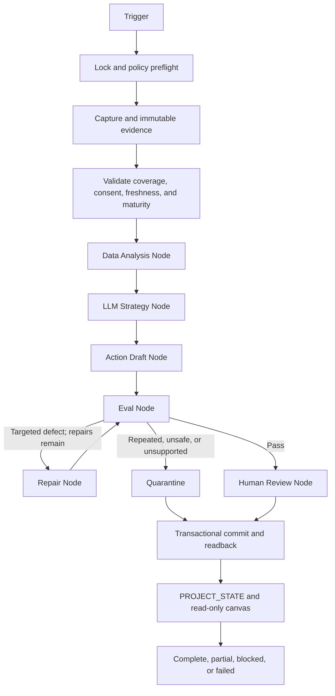

# Code the Future Growth Graph — Build Brief

Updated: 08-08-2026
Target branch: `codex/code-the-future-growth-graph-v1`
First workflow: `growth_portfolio_shadow_v1`

## Outcome

Given one immutable, evidence-backed growth capture bundle, produce:

- a trustworthy baseline or explicit baseline gap for each of the three 60-day goals;
- deterministic lane analysis;
- at most one approval-ready experiment proposal per eligible lane;
- bounded strategy and independent eval results;
- a durable human-review queue with no external action;
- append-only events, observations, experiments, errors, and outbox records;
- generated `PROJECT_STATE.md`; and
- a redacted, read-only graph canvas.

The slice is complete only when it can resume after forced interruption, reject privacy-unsafe or stale evidence, avoid duplicate observations and proposals on replay, and explain every terminal state.

## Why this is the second graph system

Opportunity Radar proved the durable control-plane pattern: typed capture contracts, immutable evidence, LangGraph checkpoints, an append-only SQLite domain ledger, bounded Agents SDK judgment, an independent eval node, crash-safe replay, generated state, and an inspection-only canvas.

Code the Future should reuse those architectural invariants, not Radar's job-specific schema or ranking policy. Growth experiments have longer maturity windows, three different evidence domains, stricter child/parent privacy, and multiple human-gated external systems.

## Current repo constraint

The canonical `main` checkout contains substantial user-owned, uncommitted website, analytics, ads-ops, and social-media work. The Meta/Instagram assets currently under `Social Media/` are not part of the clean Git baseline used by this branch.

Therefore:

- preserve the canonical checkout exactly as-is;
- develop only in the isolated graph worktree;
- use the current local assets for read-only discovery, not as committed runtime dependencies;
- require a deliberate reconciliation before merge so active work is not omitted or overwritten; and
- never treat a local asset or filename as proof of platform publication, consent, or performance.

## Scope

Included:

- Run identity, lock, idempotency, and runtime-policy hashing.
- Immutable capture-bundle and evidence-artifact ingestion.
- Typed, lane-specific source coverage and freshness.
- Deterministic normalization, deduplication, consent checks, maturity checks, KPI calculations, and baseline gaps.
- A data-analysis node that creates evidence-grounded opportunity candidates.
- A bounded Agents SDK strategy node with structured output.
- A deterministic action-draft node that creates approval-ready packages only.
- An independent eval node with actionable defects and a maximum of two targeted repairs.
- A distinct human-review node that records `awaiting_review` and stops.
- SQLite checkpoints, append-only domain state, read-after-write verification, and immutable artifacts.
- Generated project state and a static inspection-only canvas.
- Synthetic/redacted trajectory fixtures for all three lanes.

Excluded from shadow v1:

- Meta or Instagram publishing, scheduling, pinning, replying, messaging, boosting, or account changes.
- Facebook group joining, membership enumeration, posting, or messaging.
- Email, contact-form, SMS, or direct-message delivery.
- Google Ads or Meta Ads campaign mutation.
- Search Console property, sitemap, indexing, or access mutation.
- Supabase writes or learner-platform reads.
- GitHub merge, Netlify deployment, or production website changes.
- Self-modifying prompts, policies, code, or authority.
- Any mutation control in the observer canvas.

## Runtime recommendation

Use a standalone TypeScript workspace under `ops/growth-graph/` so the growth graph does not change the static-site production toolchain.

Lock the implementation to the versions verified on 08-08-2026:

- `@langchain/langgraph` `1.4.9`;
- `@langchain/langgraph-checkpoint-sqlite` `1.0.3`;
- `@openai/agents` `0.14.3`;
- `openai` `6.49.0` (latest release compatible with Agents SDK `0.14.3`);
- `zod` `4.4.3`; and
- TypeScript `7.0.2`.

LangGraph owns the outer workflow, persistence boundaries, retries, repairs, and interrupts. The Agents SDK owns only bounded structured judgment inside the strategy/eval nodes. Neither provider retries nor SDK retries may exceed the graph's recorded attempt budget.

Use the current GPT-5.6 family by workload role. The default bounded strategy/eval model is `gpt-5.6-terra`, with reasoning effort explicitly pinned to `low`; keep `gpt-5.6-sol` available only for an explicitly measured quality-first override. Pin the resolved model, effective reasoning setting, and confined evidence-root realpath in every runtime manifest rather than following a moving alias or broader filesystem boundary silently.

Do not use a `SandboxAgent` in shadow v1. The graph needs deterministic, explicitly scoped local tools rather than model-directed shell or filesystem access. If sandbox compute is added later, the trusted harness and approval state must remain outside that execution boundary.

OpenAI tracing remains disabled for real growth data in v1. The local ledger stores redacted event and decision traces. Platform trace grading may be tested only with synthetic or explicitly approved, consent-safe datasets.

## Portfolio graph

The Data Analysis, LLM Strategy, Action Draft, Eval, and Human Review nodes are explicit graph nodes. They may share infrastructure, but their inputs, authority, outputs, and errors remain separate.

## Lane contracts

### Organic social lane

Inputs:

- platform identity and follower-count snapshots;
- mature post-level Meta/Instagram insights;
- content registry, platform post IDs, format, publish time, CTA, UTM, and paid/organic status;
- approved asset references and scoped consent evidence.

Analysis:

- calculate platform-separated growth and normalized engagement;
- group results by controlled experiment variables;
- disclose maturity, reach, sample, paid influence, and missing fields;
- surface one evidence-backed next hypothesis.

Output:

- a draft content/experiment package with one changed variable, exact KPI, 72-hour measurement window, repeat/stop/scale rule, privacy result, and approval hash.

### Contact-discovery lane

Inputs:

- recent public web capture records;
- source URL, source type, geography, public contact channel, verification time,
  permission basis, and—before any group-post approval—immutable captured group
  rules with source URL, SHA-256, byte length, and capture time;
- prior discovery, outreach, referral, and do-not-contact identities.

Analysis:

- reject minors, private members, personal-profile mining, and unsupported permission;
- normalize organization/channel identity and merge provenance across duplicates;
- score mission fit, Louisville relevance, parent/community access, recency, and actionability.

Output:

- an approval-ready discovery record and optional outreach draft, never a sent message.

### Search Console lane

Inputs:

- Search Console query/page/date exports with property, capture, and freshness metadata;
- sitemap and indexing snapshots;
- public-page inventory and deterministic local SEO checks;
- GA4 organic lead and verified-purchase evidence when available.

Analysis:

- isolate non-branded parent intent;
- identify query/page opportunities with comparable position, impressions, clicks, and CTR;
- reject stale, partial, incorrectly grained, or private-path data;
- prefer technical/indexing integrity before content churn.

Output:

- one page/query experiment proposal with a 14/28-day measurement plan and exact deploy approval boundary.

## Node contracts

| Node | Required input | Allowed work | Required output | Failure route |
|---|---|---|---|---|
| Trigger | manual or scheduled request | create identifiers only | run, thread, and idempotency IDs | fail closed |
| Preflight | paths, manifest, policy | validate writable state, versions, model, limits, and policy hash | signed runtime manifest | fail closed |
| Capture | bundle plus allowed evidence root | hash, validate, and copy bounded bytes | immutable capture/evidence refs | quarantine bundle |
| Validate | typed bundle | verify source, coverage, consent, freshness, maturity, and privacy | eligible/rejected lane evidence | partial, recapture, or quarantine |
| Data analysis | eligible evidence | deterministic KPI/baseline/opportunity calculations | lane analyses and gaps | fail closed on policy error |
| LLM strategy | lane analysis plus evidence refs | semantic hypothesis and prioritization only | structured strategy proposal | retry up to two |
| Action draft | strategy proposal | deterministic draft packaging and approval hash | local action package marked draft | targeted repair |
| Eval | proposal, draft, evidence, policy | independent structured grading | pass, defects, or quarantine | repair or quarantine |
| Repair | stable defect list | revise only named proposal fields or request recapture | repaired proposal plus attempt | back to eval |
| Human review | passed proposal | record review request only | immutable `awaiting_review` record | no external action |
| Commit | all lane results | one SQLite transaction | committed domain records | fail closed |
| Verify | transaction ID | read canonical records back | verified persistence | blocked; no final claim |
| Finalize | verified state | generate projections | terminal state and next safe action | record failure |

## Canonical graph state

State must contain, at minimum:

- schema, graph, policy, prompt, model, tool, and Node versions;
- run/thread/idempotency identifiers and trigger metadata;
- 60-day objective window and metric-definition version;
- source coverage, account/property identity, capture time, `fresh_through`, and data state;
- immutable evidence references with SHA-256, producer, scope, and redaction/consent status;
- lane eligibility, baseline, maturity, and gap results;
- deterministic analyses kept separate from model proposals;
- experiment hypotheses, controlled variable, arm, KPI, comparison, and measurement window;
- draft actions, approval hash, and external-action status fixed to `not_executed`;
- eval findings, repair count, and quarantine reason;
- human-review status and decision reference when later supplied;
- transaction and readback verification;
- stable errors, retryability, costs, model calls, tool calls, and elapsed time;
- terminal status and exact next safe action.

Conversation transcripts, filenames, and model confidence are evidence only, never operational truth.

## Local persistence

Use three layers:

1. LangGraph checkpoints for pause, resume, and node-level recovery.
2. A graph-owned append-only SQLite domain ledger for runs, events, evidence, KPI observations, identities, experiments, proposals, evals, reviews, errors, and outbox drafts.
3. Content-addressed immutable artifacts under `.state/growth-graph/runs/<run-id>/`.

Do not overload learner-platform tables or the existing paid-only `ad_performance_history` table with organic, contact, or Search Console data.

## Completion oracles

- A trusted-looking filename does not prove consent, sanitization, publication, or performance.
- A valid zero requires complete verified coverage for that source and window.
- Social publication and performance are platform-specific claims.
- Contact records count once across sources and only after permission-safe qualification.
- Search analysis requires query/page grain and mature data; position alone is not success.
- Local completion requires one verified domain commit and readback.
- A duplicate trigger becomes a no-op rather than a second experiment.
- Replay cannot duplicate an observation, proposal, review request, or outbox artifact.
- A human-review record is not approval, and approval is not execution.
- External completion later requires independently verified live evidence.

## Failure and repair policy

- Configuration, policy, checkpoint, canonical-state, or consent failure: fail closed.
- Authentication, MFA, CAPTCHA, or account challenge: durable human interrupt; never bypass.
- Transient network/rate-limit failure: at most two graph-owned retries with recorded backoff.
- Missing evidence, maturity, or permission: one targeted recapture, then quarantine.
- Model/evaluator defect: at most two targeted repairs.
- Same defect twice: quarantine the proposal or block the lane.
- Optional external mirror failure: preserve verified local state and mark mirror stale.
- Unknown publish/send/deploy result: stop and inspect; never repeat blindly.

## Improvement loop

Every run creates one of five decisions per lane:

- `observe_more` — baseline or maturity is insufficient;
- `repeat` — run the same arm again for sample depth;
- `repair` — fix an evidence, privacy, instrumentation, or proposal defect;
- `stop` — the arm is harmful, invalid, stale, or ineffective; or
- `propose_scale` — mature evidence supports a human-reviewed expansion.

A promoted learning must be converted into a versioned policy note and regression fixture before it changes automated behavior.

## Cutover gates

1. Reconcile the active uncommitted growth/social work with the graph branch without losing user changes.
2. Import and count-verify existing social posts, known contacts, experiments, approvals, and do-not-contact history.
3. Capture verified day-zero baselines for all three KPIs.
4. Pass every executable privacy, consent, replay, maturity, and external-action eval.
5. Complete at least three consecutive real-input shadow cycles with no external writes.
6. Obtain Jon's review of KPI definitions, proposals, and canvas coverage.
7. Add external read adapters one at a time; keep all write adapters absent until separately approved.

No existing Code the Future automation or production workflow is disabled by shadow v1.

The branch replaces repository-root publishing with an allowlisted `public-dist/`
build. Browser runtime files are staged there; the ungated `admin/` tree, every
facilitator-only `in-person/` subtree, `netlify/functions`, edge functions,
migrations, scripts, project memory, graph source, runtime `.state`, and
`PROJECT_STATE.md` remain outside the deploy bundle. Redirect denies remain
defense in depth. This boundary must pass its deterministic build test before
merge because the current production deploy has exposed repository internals.
